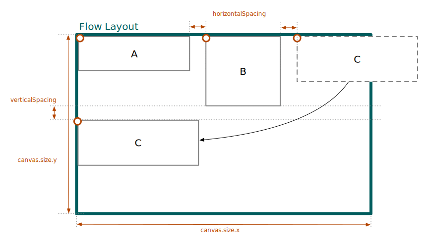
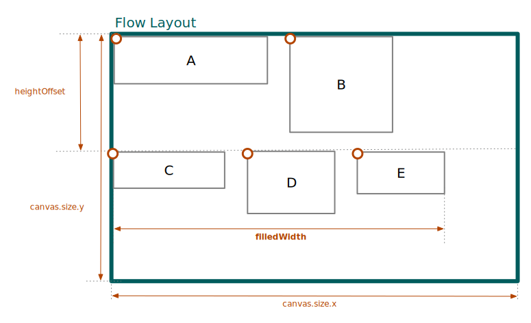

# Flow Layout

The _Flow layout_ arranges its children in a directional flow that wraps at the layout's boundary, very much like words wrap at the end of a line when writing a text.

<figure id="fig:layouts-flow-ltr">
  
  <figcaption>
    Standard Flow layout with left-to-right alignment.
  </figcaption>
</figure>

```jsonc
{
  "type": "FlowLayout",
  "verticalSpacing": 8,
  "contents": [...]
}
```

---

<figure id="fig:layouts-flow-internal">
  
  <figcaption>
    Internal fields and measures of the Flow layout.
  </figcaption>
</figure>
