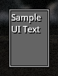

# Core Widgets

> [!WARNING]
> This list is incomplete. You can find the full list of core widgets in the [Javadoc](https://jenkins.terasology.io/teraorg/job/Libraries/job/TeraNUI/job/master/javadoc/org/terasology/nui/widgets/package-summary.html).

Each table contains the json attributes settable via a `.ui` prefab.
If a widget can have an interaction listener added, then the circumstances that will fire it are listed under the _Listener_ heading.

The source for each example can be found in this repositories code.

## Box ([UIBox])

[uibox]: https://jenkins.terasology.io/teraorg/job/Libraries/job/TeraNUI/job/master/javadoc/org/terasology/nui/widgets/UIBox.html ":target=blank"

Displays a simple box that can contain another widget or layout

| Name            | Description                                          |
| --------------- | ---------------------------------------------------- |
| `updateContent` | Should the content inside the box be updated as well |
| `content`       | The widget or layout to render inside the box        |

### Example

## Button ([UIButton])

[uibutton]: https://jenkins.terasology.io/teraorg/job/Libraries/job/TeraNUI/job/master/javadoc/org/terasology/nui/widgets/UIButton.html ":target=blank"

Displays a clickable button with custom text and/or image.

| Name          | Description                                  |
| ------------- | -------------------------------------------- |
| `image`       | The image to display on the button           |
| `text`        | The text to display on the button            |
| `clickSound`  | The sound to play when the button is clicked |
| `clickVolume` | The volume at which to play the sound        |

**Listener** Activates when the button is pressed.

### Example

## Checkbox ([UICheckbox])

[uicheckbox]: https://jenkins.terasology.io/teraorg/job/Libraries/job/TeraNUI/job/master/javadoc/org/terasology/nui/widgets/UICheckbox.html ":target=blank"

A checkbox that can be ticked or unticked.

| Name      | Description                                             |
| --------- | ------------------------------------------------------- |
| `enabled` | Controls if the checkbox should start out ticked or not |

**Listener** Triggers when ticked or unticked.

### Example

## Double Slider ([UIDoubleSlider])

[uidoubleslider]: https://jenkins.terasology.io/teraorg/job/Libraries/job/TeraNUI/job/master/javadoc/org/terasology/nui/widgets/UIDoubleSlider.html ":target=blank"

A slider bar with two sliders on it, allowing for two values to be set.
The left bar cannot higher than the right bar.

| Name         | Description                                   |
| ------------ | --------------------------------------------- |
| `minimum`    | The minimum value of the slider               |
| `range`      | The range of values available                 |
| `increment`  | Minumum amount the slider bar can move by     |
| `precision`  | Number of decimal places to show precision to |
| `valueLeft`  | Inital value of the left slider               |
| `valueRight` | Inital value of the right slider              |

### Example

## Dropdown ([UIDropdown])

[uidropdown]: https://jenkins.terasology.io/teraorg/job/Libraries/job/TeraNUI/job/master/javadoc/org/terasology/nui/widgets/UIDropdown.html ":target=blank"

A simple dropdown screen with a list of options.
The selected option is displayed in the dropdown's box.
This version is <u>not</u> scrollable.

### Example

## Scrollable Dropdown ([UIDropdownScrollable])

[uidropdownscrollable]: https://jenkins.terasology.io/teraorg/job/Libraries/job/TeraNUI/job/master/javadoc/org/terasology/nui/widgets/UIDropdownScrollable.html ":target=blank"

A scrolllable version of [Dropdown](#dropdown-uidropdown)

### Example

## Icon Bar ([UIIconBar])

[uiiconbar]: https://jenkins.terasology.io/teraorg/job/Libraries/job/TeraNUI/job/master/javadoc/org/terasology/nui/widgets/UIIconBar.html ":target=blank"

A bar comprised of icons that can display a value.

| Name           | Description                                                                   |
| -------------- | ----------------------------------------------------------------------------- |
| `halfIconMode` | The mode to use to display decimal values. Can be "SPLIT", "SHRINK" or "NONE" |
| `maxIcons`     | The number of icons to use in total                                           |
| `spacing`      | The space between each icon                                                   |
| `value`        | The current value of the bar                                                  |
| `maxValue`     | The maximum value the bar can display                                         |
| `icon`         | The icon to use in the bar                                                    |

### Example

## Image ([UIImage])

[uiimage]: https://jenkins.terasology.io/teraorg/job/Libraries/job/TeraNUI/job/master/javadoc/org/terasology/nui/widgets/UIImage.html ":target=blank"

Displays an image.
The image can be tinted set colours

| Name                | Description                                                                                                                                            |
| ------------------- | ------------------------------------------------------------------------------------------------------------------------------------------------------ |
| `image`             | The image to display                                                                                                                                   |
| `tint`              | The tint to apply (if any). Can be any value from `Color`                                                                                              |
| `ignoreAspectRatio` | Whether to stretch the image non-uniformly. This is equivalent to creating a new skin with the scale mode set to `stretch`. The default value is false |

### Example

## Label ([UILabel])

[uilabel]: https://jenkins.terasology.io/teraorg/job/Libraries/job/TeraNUI/job/master/javadoc/org/terasology/nui/widgets/UILabel.html ":target=blank"

Displays some text in a label.

| Name   | Description       |
| ------ | ----------------- |
| `text` | The text to show. |

### Example

## List ([UIList])

[uilist]: https://jenkins.terasology.io/teraorg/job/Libraries/job/TeraNUI/job/master/javadoc/org/terasology/nui/widgets/UIList.html ":target=blank"

Displays a vertical list of buttons.
Each element in the list can be selected.

### Example

### Loading Bar (`UILoadBar`)

A loading bar. It uses a tiled texture to display the load amount.

| Name          | Description                                                             |
| ------------- | ----------------------------------------------------------------------- |
| `fillTexture` | The texture to tile across the bar.                                     |
| `animate`     | Controls whether the bar should be animated (Tiles scroll to the right) |
| `value`       | The inital percentage loaded. Can be from 0 to 1.                       |

**Example**

## Scrollbar ([UIScrollbar])

[uiscrollbar]: https://jenkins.terasology.io/teraorg/job/Libraries/job/TeraNUI/job/master/javadoc/org/terasology/nui/widgets/UIScrollbar.html ":target=blank"

A scrollbar that can be oriented horizontally or vertically.

| Name       | Description                                  |
| ---------- | -------------------------------------------- |
| `value`    | The initial level of scrolling               |
| `minimum`  | The smallest value scrollable to             |
| `range`    | The maximum value scrollable to              |
| `vertical` | A boolean setting the orientation of the bar |

### Example

## Scrolling Text ([UIScrollingText])

[uiscrollingtext]: https://jenkins.terasology.io/teraorg/job/Libraries/job/TeraNUI/job/master/javadoc/org/terasology/nui/widgets/UIScrollingText.html ":target=blank"

A widget that displays some text that scrolls upwards.

| Name           | Description                                                    |
| -------------- | -------------------------------------------------------------- |
| `text`         | The text to display                                            |
| `step`         | The number of pixels to go up each frame                       |
| `lineSpacing`  | The space between each line of text                            |
| `offsetBottom` | The offset from the bottom of the parent widget                |
| `offsetTop`    | The offset from the top of the parent widget                   |
| `autoReset`    | Sets whether the widget should restart scrolling once finished |

### Example

## Slider ([UISlider])

[uislider]: https://jenkins.terasology.io/teraorg/job/Libraries/job/TeraNUI/job/master/javadoc/org/terasology/nui/widgets/UISlider.html ":target=blank"

A slider bar that can be set to any value in a range.

| Name        | Description                                          |
| ----------- | ---------------------------------------------------- |
| `increment` | The smallest increment a value can be changed by     |
| `value`     | The initial value of the slider                      |
| `precision` | The number of decimal points to display the value to |
| `range`     | The largest value settable                           |
| `minimum`   | The smallest value settable                          |

### Example

## Space ([UISpace])

[uispace]: https://jenkins.terasology.io/teraorg/job/Libraries/job/TeraNUI/job/master/javadoc/org/terasology/nui/widgets/UISpace.html ":target=blank"

A spacer UI element designed to be used with some layouts

| Name   | Description                                           |
| ------ | ----------------------------------------------------- |
| `size` | An array containing the horizontal and vertical size. |

### Example

## Text ([UIText])

[uitext]: https://jenkins.terasology.io/teraorg/job/Libraries/job/TeraNUI/job/master/javadoc/org/terasology/nui/widgets/UIText.html ":target=blank"

A generic multi-line text box.

| Name        | Description                                       |
| ----------- | ------------------------------------------------- |
| `text`      | The text to display                               |
| `multiline` | Should the content be displayed on multiple lines |
| `readOnly`  | Allows the text to be editable when false.        |

### Example

